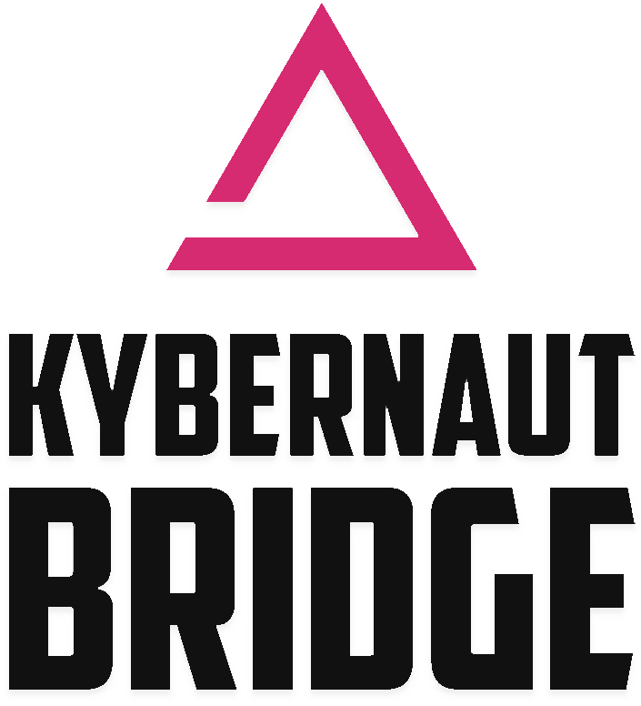

# Kybernaut Bridge

This is a bridge to push zKillboard littlekill events from its websocket to the Abyss Tracker via a webhook.

## Config

ENV variables:
- `HOST_URL`: Abyss Tracker webhook listen endpoint
- `PASSCODE`: Passcode specified by the Abyss Tracker
- `REGION_IDS`: Region IDs, separated by semicolons (`;`)